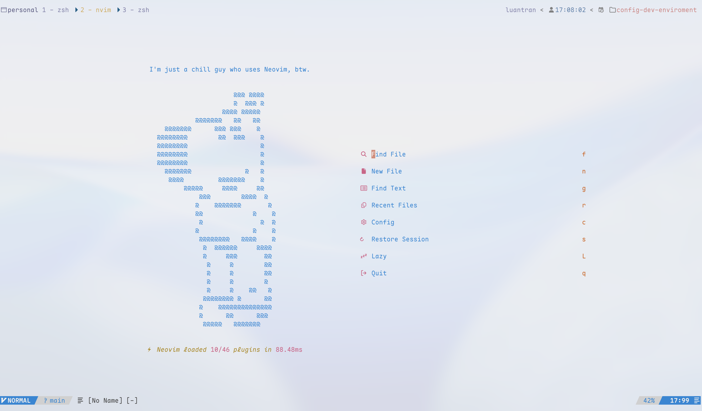
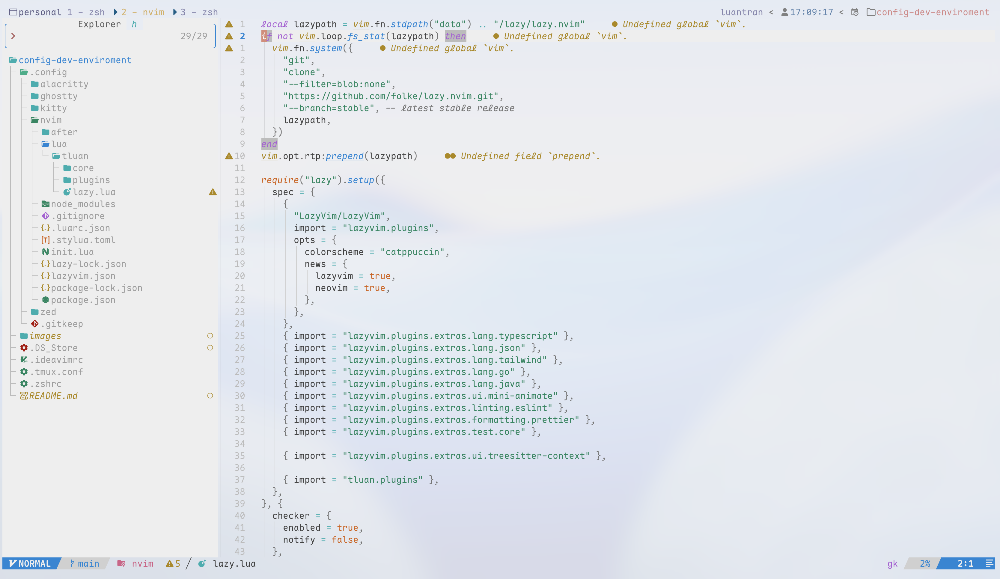

## My Dev Environment Configs




## Contents

- vim (Neovim) config
- tmux config
- git config
- zsh config

## Neovim setup

### Requirements

- Neovim >= **0.11.0** (needs to be built with **LuaJIT**)
- Git >= **2.19.0** (for partial clones support)
- [LazyVim](https://www.lazyvim.org/)
- a [Nerd Font](https://www.nerdfonts.com/)(v3.0 or greater) **_(optional, but needed to display some icons)_**
- [lazygit](https://github.com/jesseduffield/lazygit) **_(optional)_**
- a **C** compiler for `nvim-treesitter`. See [here](https://github.com/nvim-treesitter/nvim-treesitter#requirements)
- a terminal that support true color and *undercurl*:
  - [Ghostty]("https://ghostty.org/")

### Install Neovim

```bash
brew install neovim
```

### Config Neovim

Clone this repo and copy the config folder to your home directory

```bash
git clone https://github.com/luan-tran/config-dev-enviroment.git
cp -r config-dev-enviroment/.config/nvim ~/.config
```
